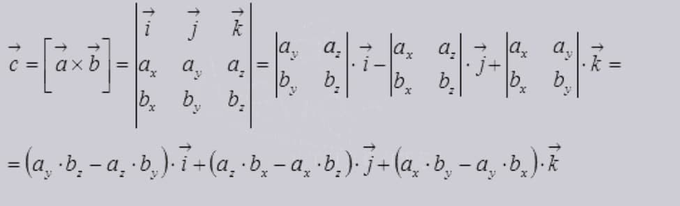

# GL-assignment

# About
************
This program takes x and y coordinates of four points and tells if one of the points is in the triangle.
The position of the points are checked by the z component of the cross product.

If the wanted point is inside of the triangle z components of all cross products will have the same sign. In case point placed on the other vector(side of the triangle) cross-product equals 0.  
The program takes command-line arguments, files with coordinates inside. Also, the user can type in coordinates while program workflow if no command-line parameters were given.

Example of parameters in file are given in f.txt file. Every 2 numbers are x,y coordinates of corresponding point.
f.txt:
  x y x y x y x y

# How to start
************

## Clone the repository:
```
  git clone https://github.com/Jeyky/GL-assignment.git
```
## Build:
```
  make
```
## Run:
```
./main f.txt
```
or
```
./main
```
or
```
./main 0 0 0 3 3 0 1 1
```
These numbers are x,y coordinates of 4 points
That values means point A[0;0], point B[0;3], point C[3;0]; point D[1;1].
